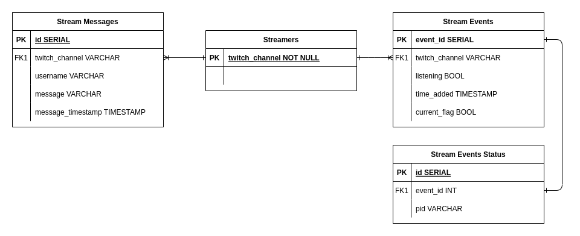
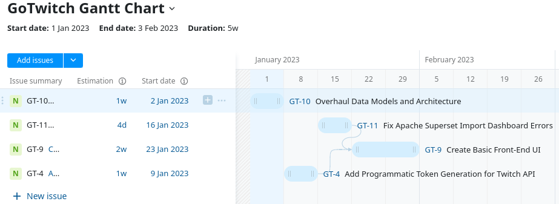

# Go-Twitch Analytics

 <b>Golang meets Twitch chat!</b> 

  
   

## What is Go-Twitch Analytics?
Go-Twitch is a self-service, containerized solution to aggregating and visualizing Twitch chat data in near-real time.

Go-Twitch is a rewrite of my first data engineering Python project, but written in Go (with more elaborate technology).

Users can go into the web-app (WIP) and select their own list of Twitch chat streams to aggregate those messages before having those messages analyzed, visualizing the data in near real-time.

This is in effort to continously learn and exit my comfort zones to become a great data engineer.
## Example Dashboard

## Demo

(redirects to youtube)

## System Architecture Diagram

## Entity Relationship Diagram
   

## Disclaimers and Notes
Development on GoTwitch is currently on hold.

This project is continously being updated and developed, with architecture and system design improvements being prioritized. *It is not yet fit for consumer use yet*.

Due to budget constraints, this project is locally containerized. In the ideal world, it would be hosted on AWS and be a public facing website. The data architecture would probably just be an RDS instance. 

Top priority development goals:
1. Redesigned, normalized data models
2. OAuth handled programatically
3. MVP front-end UI for a user-friendly, accessible experience

