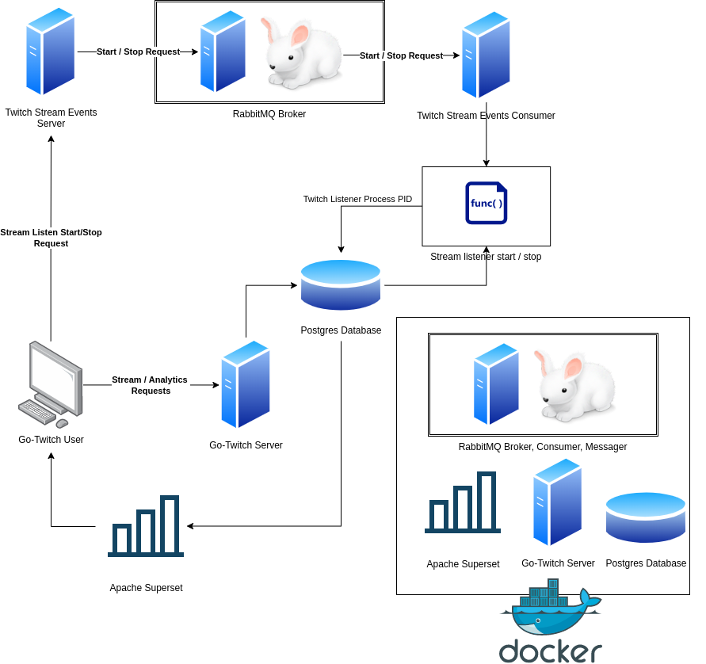

# Go-Twitch Analytics

  
   

 <b>Golang meets Twitch chat! 

## What is Go-Twitch Analytics?
Go-Twitch is a self-service, containerized solution to aggregating and visualizing Twitch chat data in near-real time.

Go-Twitch is a rewrite of my first data engineering Python project, but written in Go (with more elaborate technology).

Users can go into the web-app (WIP) and select their own list of Twitch chat streams to aggregate those messages before having those messages analyzed, visualizing the data in near real-time.

This is in effort to continously learn and exit my comfort zones to become a great data engineer.
## Example Dashboard

## Demo

(redirects to youtube)

## Architecture Diagram

## Project Insight
1. __Technologies used__
    1. Go
    1. Docker
    1. Postgres
    1. Superset
    1. RabbitMQ
1. __Engineering Challenges & Learning Insights__
    1. Learning how to architect a REST API powered service that also triggers a long-running, blocking twitch.tv chat listener service
        1. REST APIs are meant for quick requests that send/return data fast, so I knew that I probably had to make the architecture communicate between two services (web app, and twitch.tv chat listener)
    1. Learning how to make a web app, what routers are, general API design
        1. My professional and personal experience is in CLI apps and automation of data by coding ETL pipelines, so this was a whole new domain
    1. Learning more about Docker at a more in-depth scope
        1. Learning how to orchestrate multiple Docker containers to make collaborative development and start-up of the service fast and easy
            1. My experience in Docker is more editing given files, with at most one container, so learning how to organize multiple containers was very important
        1. Learning how to make Docker containers communicate between each other: general Docker networking concepts
1. __Reflections__
    1. I should be more proactive and advocate for writing unit tests early into the project
    1. I suppose the trendy thing to do to orchestrate the two services architecture was maybe use gRPC
    1. I still have a lot to learn about Go, but I feel like I can be mostly productive in it now
    1. There is a lot of value in slowing down development to make sure architecture and code choices result in a scalable, reliable product
        1. I know from experience this can sometimes be an ideal not always possible due to budget/timeline constraints, but I should strive for this
    1. I should have spent more time striving towards a well-tested, fault-tolerant product
        1. I am still developing this product, so once I get a final MVP open for a full web-based experience, I will work towards cleaning tech debt
    

## Disclaimers and Notes
This project is continously being updated and developed, with UI/front-end capability being prioritized.

Due to budget constraints, this project is locally containerized. In the ideal world, it would be hosted on AWS and be a public facing website.

Top priority development goals:
1. MVP front-end UI for a user-friendly experience 
2. Unit testing
3. Github Actions CI/CD pipeline

