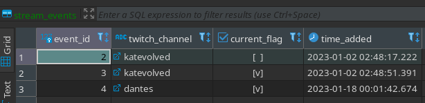
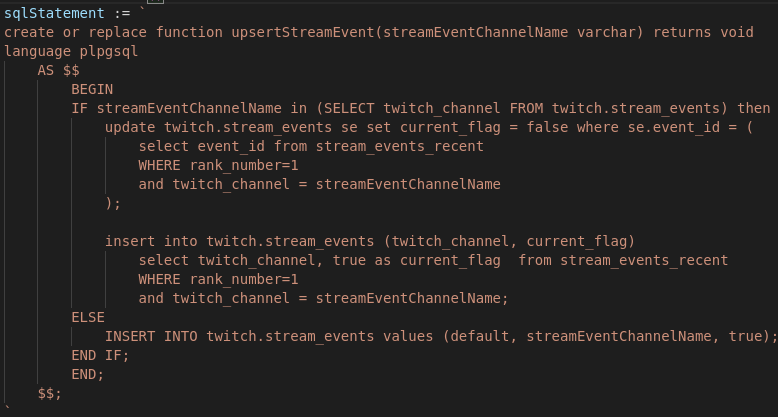
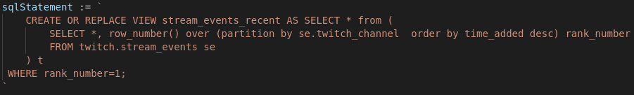

Below is a collection of code snippets and project work. Many of the snippets below I found interesting to develop or were the first time I implemented something.

## Data Modelling and SQL: 

### Stream Events
####  SCD Type 2
When a user sends a request to the server to start aggregating chat data, that request is an event inserted into the database. Each event is when a user on the web app clicks to begin or stop listening to a Twitch channel.

####  SCD Type 2 Using Postgres Function

If a user is trying to listen to a stream for the first time, then that stream does not have an entry in the table. Otherwise, that stream has an entry in the table.

The below SQL function handles that logic, setting the old row as not current and inserting a new row. If that stream is not in the table yet, then it simply enters the first row for that stream and sets it as current.

The SQL function references a view (my first time creating a view!)

